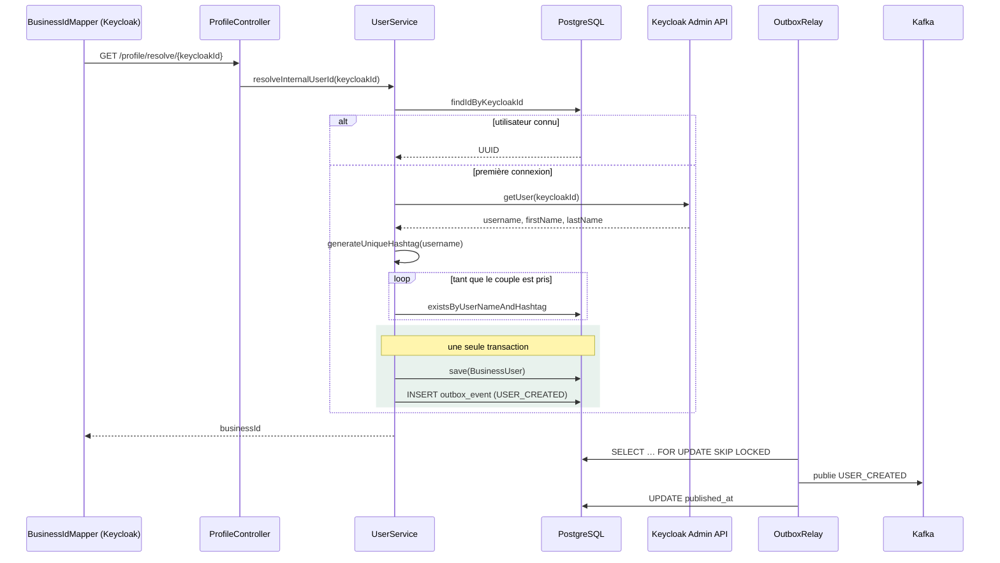

# wely-users

Service de gestion des profils utilisateurs et **pont entre l'identité Keycloak et l'identité métier** de la plateforme [Wely Calendar](https://github.com/WelyLabs/wely-platform).

C'est le seul service qui écrit dans PostgreSQL, le seul qui appelle l'Admin API Keycloak, et le producteur de l'événement `USER_CREATED` dont dépend le graphe social. Cet événement part par un **outbox transactionnel** : il est écrit en base dans la même transaction que l'utilisateur, puis relayé vers Kafka.

---

## Rôle

| | |
|---|---|
| **Port** | 8082 |
| **Préfixe** | `/user-service` (exposé via la gateway sur `/api/v1/user-service/**`) |
| **Base** | PostgreSQL via R2DBC |
| **Produit** | `USER_CREATED` sur Kafka |
| **Dépend de** | Keycloak (Admin API, `client_credentials`) |

---

## Stack

Java 25 · Spring Boot 4 · WebFlux · Spring Data R2DBC · Spring Cloud Stream (Kafka) · MapStruct · Lombok · OAuth2 Resource Server + Client

---

## Architecture

Architecture hexagonale. Le domaine déclare trois ports ; l'infrastructure fournit trois adaptateurs.

```
                  ┌──────────────────────────────────────┐
  HTTP            │           application/rest           │
  ───────────────▶│   ProfileController                  │
                  └──────────────────┬───────────────────┘
                                     │
                  ┌──────────────────▼───────────────────┐
                  │              domain/                 │
                  │                                      │
                  │   models/   BusinessUser (record)    │
                  │   services/ UserService  (POJO)      │
                  │                                      │
                  │   ports/                             │
                  │     UserRepository ──────────┐       │
                  │     IdentityProvider ────────┼─┐     │
                  │     UserEventPublisher ──────┼─┼─┐   │
                  │     TransactionBoundary ─────┼─┼─┼─┐ │
                  └──────────────────────────────┼─┼─┼─┼─┘
                                                 │ │ │ │
                  ┌──────────────────────────────▼─▼─▼─▼─┐
                  │           infrastructure/            │
                  │                                      │
                  │  persistence/  R2dbcUserRepositoryAdapter
                  │                → UserR2dbcRepository │
                  │                OutboxUserEventPublisherAdapter
                  │                → R2dbcOutboxEventStoreAdapter
                  │                R2dbcTransactionBoundaryAdapter
                  │  identity/     IdentityAuthAdapter   │
                  │                → KeycloakAdminApi    │
                  │  messaging/    OutboxRelay           │
                  │                → KafkaOutboxDispatcher
                  │                → StreamBridge        │
                  └──────────┬─────────┬─────────┬───────┘
                             ▼         ▼         ▼
                       PostgreSQL  Keycloak    Kafka
```

Les quatre ports sont fournis par l'infrastructure. `UserEventPublisher` est le plus intéressant : son adaptateur **n'appelle plus Kafka**, il insère une ligne en base. Le domaine n'a pas changé — c'est l'argument pour avoir un port.

`UserService` est un **POJO sans annotation Spring**, instancié par `UsersApplicationConfig` :

```java
@Bean
public UserService userService(UserRepository repository,
                               IdentityProvider identityProvider,
                               UserEventPublisher publisher,
                               TransactionBoundary transactionBoundary) {
    return new UserService(repository, identityProvider, publisher, transactionBoundary);
}
```

Il se teste donc sans contexte Spring, avec trois implémentations d'interfaces.

---

## Le cœur du service : `resolveInternalUserId`

C'est l'opération qui justifie l'existence du service. Appelée par le [mapper Keycloak](https://github.com/WelyLabs/wely-identity) pendant l'émission d'un token, elle traduit un UUID Keycloak en identifiant métier — **et crée l'utilisateur s'il n'existe pas encore**.



La publication **ne fait plus partie de la requête**. Keycloak attend l'identifiant métier, pas un aller-retour vers le broker ; et un Kafka indisponible fait grossir une file au lieu de perdre un événement.

Le provisioning est **paresseux** : pas de webhook Keycloak, pas de batch de synchronisation. L'utilisateur est matérialisé au moment où son premier token est émis.

### Le hashtag

Un utilisateur est identifié publiquement par `Pseudo#1234`, à la manière de Discord. Le hashtag est tiré au hasard entre 1000 et 9999 et retiré tant que le couple `(user_name, hashtag)` est déjà pris. L'unicité est **garantie par la base**, pas par le code :

```sql
CONSTRAINT unique_user_identity UNIQUE (user_name, hashtag)
```

Le tirage aléatoire évite la contention d'un compteur séquentiel partagé ; la contrainte SQL reste le dernier rempart en cas de course.

---

## API

Toutes les routes sont préfixées par `/user-service` et exposées via la gateway sur `/api/v1/user-service/**`.

| Méthode | Route | Auth | Description |
|---|---|---|---|
| `GET` | `/profile` | JWT | Profil de l'utilisateur courant (identité lue dans le claim `businessId`) |
| `GET` | `/profile/resolve/{keycloakId}` | `X-Internal-Secret` | **Interne.** Résout un UUID Keycloak en `businessId`, en créant l'utilisateur si besoin |

`/profile/resolve/**` est le seul endpoint exempté de l'authentification JWT : il est appelé par Keycloak *pendant* l'émission du token, donc avant qu'un token existe. Il est protégé par un secret partagé vérifié dans un `WebFilter` dédié.

### OpenAPI

La spécification est générée par `springdoc-openapi` et servie sans jeton :

| | |
|---|---|
| Spec JSON | `http://localhost:8082/v3/api-docs` |
| Swagger UI | `http://localhost:8082/swagger-ui.html` |

Ces deux chemins ne sont **pas** routés par la gateway, et le Service est en `ClusterIP` : rien
hors du cluster ne peut les atteindre. La documentation reste donc active en permanence — c'est
la topologie réseau qui la protège, pas un drapeau.

> Le préfixe de chemin du service est appliqué par package (`…application.rest`) et non par
> annotation. Sélectionner sur `@RestController` attrapait aussi le contrôleur de springdoc, ce
> qui déplaçait la spec en `/user-service/v3/api-docs` derrière l'authentification.

### Modèle

```java
public record BusinessUser(
        UUID id,
        String userName,
        Integer hashtag,
        String firstName,
        String lastName,
        String profilePicUrl,
        LocalDateTime joinedDate
) {}
```

### Schéma

```sql
CREATE TABLE app_user (
    id              UUID PRIMARY KEY DEFAULT gen_random_uuid(),
    keycloak_id     TEXT UNIQUE NOT NULL,
    user_name       TEXT NOT NULL,
    hashtag         INTEGER NOT NULL,
    first_name      TEXT,
    last_name       TEXT,
    profile_pic_url TEXT,
    joined_date     TIMESTAMP WITHOUT TIME ZONE NOT NULL,
    CONSTRAINT unique_user_identity UNIQUE (user_name, hashtag)
);

CREATE TABLE outbox_event (
    id           BIGSERIAL PRIMARY KEY,   -- ORDER BY id = ordre de publication
    aggregate_id UUID        NOT NULL,    -- clé de partition Kafka
    type         TEXT        NOT NULL,    -- destination + classe du payload
    payload      TEXT        NOT NULL,
    created_at   TIMESTAMPTZ NOT NULL DEFAULT now(),
    published_at TIMESTAMPTZ,             -- NULL = en attente
    attempts     INTEGER     NOT NULL DEFAULT 0,
    last_error   TEXT
);

CREATE INDEX idx_outbox_event_pending ON outbox_event (id) WHERE published_at IS NULL;
```

Les deux tables sont décrites dans `db/migration/`, **volontairement hors du classpath** pour qu'aucune initialisation Spring ne les exécute à l'insu de qui que ce soit. `V2__create_outbox_event.sql` doit être appliqué **avant** de déployer la version qui écrit dedans : l'insertion fait partie du provisioning, donc une table absente casse l'inscription au lieu de la dégrader.

---

## Événement publié

**Topic** `USER_CREATED` · clé de partition `payload.userId` · `acks=all`

```json
{
  "userId": "550e8400-e29b-41d4-a716-446655440000",
  "userName": "theo",
  "hashtag": 4271,
  "profilePicUrl": null
}
```

Consommé par [`wely-social`](https://github.com/WelyLabs/wely-social), qui crée le nœud correspondant dans Neo4j.

---

## L'outbox transactionnel

### Le problème

Écrire en PostgreSQL et publier sur Kafka sont deux systèmes différents : il n'existe pas de commit qui couvre les deux. Entre le `COMMIT` et le `send()`, un redémarrage de pod, un OOM kill ou un broker injoignable laissait un utilisateur en base **sans nœud social**, définitivement — rien ne réessayait, et rien ne le signalait.

`@Transactional` n'aurait rien réglé : un rollback annule des écritures en base, pas un message déjà parti sur un broker. Il aurait même inversé le défaut, en ajoutant le cas « événement publié pour un utilisateur qui n'existe pas ».

### Le motif

On ne rend pas les deux systèmes atomiques, on **ramène le deuxième dans le premier** :

1. `UserService` demande à `TransactionBoundary` d'exécuter `save` + `publish` comme une seule unité.
2. `OutboxUserEventPublisherAdapter` n'appelle pas Kafka — il insère une ligne dans `outbox_event`, dans la même transaction.
3. `OutboxRelay`, hors du chemin de requête, lit les lignes non publiées, les envoie, et les marque.

La seule chose à garantir n'est plus que deux systèmes réussissent ensemble, mais qu'**un seul finisse par réussir**.

### Le relais

```
① réclamer   SELECT … WHERE published_at IS NULL … FOR UPDATE SKIP LOCKED
② publier    un message par ligne, dans l'ordre des id
③ marquer    UPDATE published_at
```

- **`FOR UPDATE SKIP LOCKED`** : deux instances prennent des lots disjoints sans s'attendre. Le service tourne à un réplica aujourd'hui, donc ça ne sert à rien — et c'est précisément pour ça que c'est écrit maintenant : passer à deux est une ligne de manifeste, et la double publication que ça provoquerait ne s'annonce nulle part.
- **La fenêtre entre ② et ③ ne peut pas être fermée.** Un processus qui meurt là a envoyé l'événement sans l'avoir noté : il repartira. La livraison est *at-least-once*, et le consommateur doit être idempotent — `wely-social` l'est déjà, son `MERGE` Cypher est idempotent par construction.
- **Message empoisonné** : une ligne illisible bloquerait la tête de file, puisque la lecture suit l'ordre des id. Au-delà de `max-attempts` elle sort de la sélection et reste en table avec son `last_error`.
- **Pas d'ordonnanceur** : `Mono.repeatWhen` plutôt que `@Scheduled` (thread bloquant) ou `Flux.interval` (émet au rythme de l'horloge et déborde dès que le consommateur prend du retard). Le délai se place *entre* deux passes, qui ne peuvent donc pas se chevaucher.
- **Une erreur non rattrapée terminerait le flux** et le relais s'arrêterait définitivement, sans bruit. L'`onErrorResume` est à l'intérieur de la passe répétée, et un gestionnaire d'erreur sur le `subscribe` sert de second filet.

### Ce qu'on garde comme coût

Une table à purger, un délai d'une seconde en moyenne avant publication, et des doublons possibles. En échange, un événement ne se perd plus.

---

## Gestion des erreurs

Deux hiérarchies distinctes — métier et technique — traduites par `GlobalErrorHandler`.

| Code | HTTP | Signification |
|---|---|---|
| `USR-BUS-001` | 404 | Utilisateur introuvable |
| `USR-BUS-002` | 409 | Utilisateur déjà existant pour cette identité |
| `USR-BUS-003` | 409 | Plus aucun hashtag disponible pour ce pseudo |
| `USR-VAL-001` | 400 | Validation du corps de requête, détail par champ |
| `USR-REQ-000` | *repris* | Chemin inconnu, méthode non autorisée |
| `USR-TEC-001` | 502 | Keycloak injoignable |
| `USR-TEC-002` | 502 | Base de données injoignable |
| `USR-TEC-003` | 502 | Kafka injoignable |

**502 et non 500 pour les erreurs techniques** : la requête était valide et le service tourne —
c'est une dépendance qui est tombée, et 502 le dit précisément.

Les adaptateurs traduisent les exceptions d'infrastructure (`DataIntegrityViolationException`,
erreurs WebClient) à la frontière : le domaine ne voit jamais d'exception technique.

Toutes les réponses d'erreur sont des `ProblemDetail` (RFC 7807), avec un `code` stable qu'un
client peut tester et un `timestamp` :

```json
{
  "type": "https://welylabs.app/problems/usr-bus-001",
  "title": "User not found",
  "status": 404,
  "detail": "No user matches the given identifier.",
  "instance": "/user-service/profile/8f2c…",
  "code": "USR-BUS-001",
  "timestamp": "2026-09-30T19:23:43.598673Z"
}
```

> `USR-REQ-000` rend le statut d'origine d'une `ResponseStatusException` — 404 sur un
> chemin inconnu, 405 sur une méthode non autorisée. Sans lui, le handler `Exception.class`
> les avalait toutes et **tout chemin inconnu répondait 500**. C'est le genre de défaut qu'un
> test de route nominale ne voit jamais.
---

## Configuration

| Variable | Description |
|---|---|
| `DB_URL` | URL R2DBC PostgreSQL |
| `DB_USERNAME` / `DB_PASSWORD` | Identifiants base |
| `KEYCLOAK_ISSUER_URI` | Issuer **public** — validation de l'émetteur du token |
| `KEYCLOAK_INTERNAL_JWK_SET_URI` | JWKS **interne** au cluster — récupération des clés |
| `KEYCLOAK_INTERNAL_TOKEN_URI` | Endpoint token interne (`client_credentials`) |
| `KEYCLOAK_BASE_URL` | Base de l'Admin API Keycloak |
| `KEYCLOAK_CLIENT_SECRET` | Secret du client `wely-users-api-client` |
| `KAFKA_BOOTSTRAP_SERVER` | Brokers Kafka |
| `KAFKA_KEY` / `KAFKA_SECRET` | Identifiants SASL |
| `OUTBOX_RELAY_ENABLED` | Démarre le relais (`true` par défaut) |

Réglages de l'outbox, dans `application.properties` :

| Propriété | Défaut | Rôle |
|---|---|---|
| `app.outbox.relay.poll-interval` | `2s` | Délai entre deux passes ; la moitié est la latence moyenne de publication |
| `app.outbox.relay.batch-size` | `100` | Lignes réclamées par passe |
| `app.outbox.relay.max-attempts` | `5` | Au-delà, l'événement sort de la file au lieu de la bloquer |
| `app.outbox.purge.interval` | `1h` | Fréquence de la purge |
| `app.outbox.purge.retention` | `7d` | Durée de conservation des lignes publiées |

Voir [Validation du JWT derrière un ingress](https://github.com/WelyLabs/wely-platform#validation-du-jwt-derrière-un-ingress) pour la raison de la dissociation issuer/JWKS.

---

## Démarrage

```bash
./mvnw spring-boot:run -Dspring-boot.run.profiles=dev
```

Le profil `dev` pointe sur `localhost` (PostgreSQL 5432, Keycloak 8080, Kafka 9092).

Pour lancer **toute la plateforme** (bases, Keycloak, gateway, frontend, les quatre services) en une commande sur un Kubernetes local :

```bash
git clone https://github.com/WelyLabs/wely-gitops-infra && cd wely-gitops-infra
kubectl apply -k overlays/local --server-side
```

---

## Tests

```bash
./mvnw test                    # tests unitaires
./mvnw test jacoco:report      # + couverture → target-maven/site/jacoco/
```

Le domaine est testé sans Spring ; les adaptateurs le sont avec Mockito et `StepVerifier`.

Les classes `*IntegrationTest` démarrent un PostgreSQL avec Testcontainers et sont **optionnelles** : la CI pose `CI=true`, en local il faut `-Dintegration.tests=true` et un démon Docker vivant.

```bash
./mvnw test -Dintegration.tests=true
```

Elles portent sur ce qu'un mock ne peut pas montrer : que `FOR UPDATE SKIP LOCKED` donne bien des lots disjoints à deux transactions concurrentes, et que l'utilisateur et sa ligne d'outbox sont validés ou annulés **ensemble**.

> **Note build :** ce service produit dans `target-maven/` et non `target/` (propriété `build.dir` du `pom.xml`).

---

## Limites connues

- **Pas d'outil de migration.** Les fichiers de `db/migration/` sont appliqués à la main, sans Flyway ni Liquibase. Rien ne vérifie au démarrage que le schéma correspond au code.
- **Pas de réconciliation.** L'outbox empêche une classe de pannes ; il ne dit pas si le graphe social a dérivé pour une autre raison. Comparer le nombre de lignes `app_user` au nombre de nœuds `User` couvrirait *toutes* les causes.
- **Le relais tient sa transaction pendant l'envoi.** Les verrous durent le temps de l'appel au broker. C'est le bon compromis à un événement par inscription, pas à un débit soutenu.
