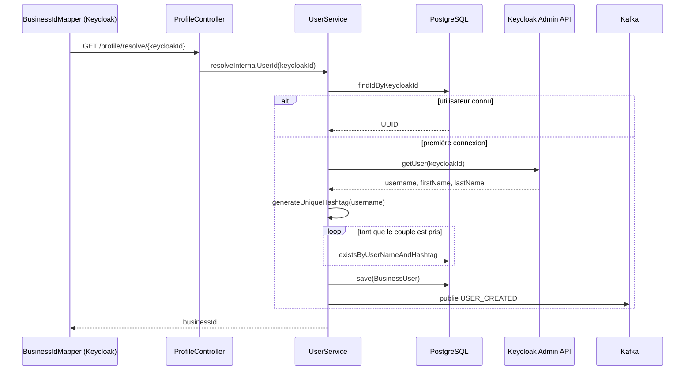

# wely-users

Service de gestion des profils utilisateurs et **pont entre l'identité Keycloak et l'identité métier** de la plateforme [Wely Calendar](https://github.com/WelyLabs/wely-platform).

C'est le seul service qui écrit dans PostgreSQL, le seul qui appelle l'Admin API Keycloak, et le producteur de l'événement `USER_CREATED` dont dépend le graphe social.

---

## Rôle

| | |
|---|---|
| **Port** | 8082 |
| **Préfixe** | `/user-service` (exposé via la gateway sur `/api/v1/user-service/**`) |
| **Base** | PostgreSQL via R2DBC |
| **Produit** | `USER_CREATED` sur Kafka |
| **Dépend de** | Keycloak (Admin API, `client_credentials`) |

---

## Stack

Java 25 · Spring Boot 4 · WebFlux · Spring Data R2DBC · Spring Cloud Stream (Kafka) · MapStruct · Lombok · OAuth2 Resource Server + Client

---

## Architecture

Architecture hexagonale. Le domaine déclare trois ports ; l'infrastructure fournit trois adaptateurs.

```
                  ┌──────────────────────────────────────┐
  HTTP            │           application/rest           │
  ───────────────▶│   ProfileController                  │
                  └──────────────────┬───────────────────┘
                                     │
                  ┌──────────────────▼───────────────────┐
                  │              domain/                 │
                  │                                      │
                  │   models/   BusinessUser (record)    │
                  │   services/ UserService  (POJO)      │
                  │                                      │
                  │   ports/                             │
                  │     UserRepository ────────┐         │
                  │     IdentityProvider ──────┼──┐      │
                  │     UserEventPublisher ────┼──┼──┐   │
                  └────────────────────────────┼──┼──┼───┘
                                               │  │  │
                  ┌────────────────────────────▼──▼──▼───┐
                  │           infrastructure/            │
                  │                                      │
                  │  persistence/  JpaUserRepositoryAdapter
                  │                → UserR2dbcRepository │
                  │  identity/     IdentityAuthAdapter   │
                  │                → KeycloakAdminApi    │
                  │  messaging/    KafkaUserEventPublisherAdapter
                  │                → StreamBridge        │
                  └──────────┬─────────┬─────────┬───────┘
                             ▼         ▼         ▼
                       PostgreSQL  Keycloak    Kafka
```

`UserService` est un **POJO sans annotation Spring**, instancié par `UsersApplicationConfig` :

```java
@Bean
public UserService userService(UserRepository repository,
                               IdentityProvider identityProvider,
                               UserEventPublisher publisher) {
    return new UserService(repository, identityProvider, publisher);
}
```

Il se teste donc sans contexte Spring, avec trois implémentations d'interfaces.

---

## Le cœur du service : `resolveInternalUserId`

C'est l'opération qui justifie l'existence du service. Appelée par le [mapper Keycloak](https://github.com/WelyLabs/wely-identity) pendant l'émission d'un token, elle traduit un UUID Keycloak en identifiant métier — **et crée l'utilisateur s'il n'existe pas encore**.



Le provisioning est **paresseux** : pas de webhook Keycloak, pas de batch de synchronisation. L'utilisateur est matérialisé au moment où son premier token est émis.

### Le hashtag

Un utilisateur est identifié publiquement par `Pseudo#1234`, à la manière de Discord. Le hashtag est tiré au hasard entre 1000 et 9999 et retiré tant que le couple `(user_name, hashtag)` est déjà pris. L'unicité est **garantie par la base**, pas par le code :

```sql
CONSTRAINT unique_user_identity UNIQUE (user_name, hashtag)
```

Le tirage aléatoire évite la contention d'un compteur séquentiel partagé ; la contrainte SQL reste le dernier rempart en cas de course.

---

## API

Toutes les routes sont préfixées par `/user-service` et exposées via la gateway sur `/api/v1/user-service/**`.

| Méthode | Route | Auth | Description |
|---|---|---|---|
| `GET` | `/profile` | JWT | Profil de l'utilisateur courant (identité lue dans le claim `businessId`) |
| `GET` | `/profile/resolve/{keycloakId}` | `X-Internal-Secret` | **Interne.** Résout un UUID Keycloak en `businessId`, en créant l'utilisateur si besoin |

`/profile/resolve/**` est le seul endpoint exempté de l'authentification JWT : il est appelé par Keycloak *pendant* l'émission du token, donc avant qu'un token existe. Il est protégé par un secret partagé vérifié dans un `WebFilter` dédié.

### Modèle

```java
public record BusinessUser(
        UUID id,
        String userName,
        Integer hashtag,
        String firstName,
        String lastName,
        String profilePicUrl,
        LocalDateTime joinedDate
) {}
```

### Schéma

```sql
CREATE TABLE app_user (
    id              UUID PRIMARY KEY DEFAULT gen_random_uuid(),
    keycloak_id     TEXT UNIQUE NOT NULL,
    user_name       TEXT NOT NULL,
    hashtag         INTEGER NOT NULL,
    first_name      TEXT,
    last_name       TEXT,
    profile_pic_url TEXT,
    joined_date     TIMESTAMP WITHOUT TIME ZONE NOT NULL,
    CONSTRAINT unique_user_identity UNIQUE (user_name, hashtag)
);
```

---

## Événement publié

**Topic** `USER_CREATED` · clé de partition `payload.userId` · `acks=all`

```json
{
  "userId": "550e8400-e29b-41d4-a716-446655440000",
  "userName": "theo",
  "hashtag": 4271,
  "profilePicUrl": null
}
```

Consommé par [`wely-social`](https://github.com/WelyLabs/wely-social), qui crée le nœud correspondant dans Neo4j.

---

## Gestion des erreurs

Deux hiérarchies distinctes, traduites en réponses HTTP par un `@ControllerAdvice`.

| Code | HTTP | Signification |
|---|---|---|
| `USR_BUS_001` | 404 | Utilisateur introuvable |
| `USR_BUS_002` | 409 | Utilisateur déjà existant |
| `USR_TEC_001` | 500 | Keycloak injoignable |
| `USR_TEC_002` | 500 | Base de données injoignable |
| `USR_TEC_003` | 500 | Kafka injoignable |

Les adaptateurs traduisent les exceptions techniques (`DataIntegrityViolationException`, erreurs WebClient) à la frontière : le domaine ne voit jamais d'exception d'infrastructure.

---

## Configuration

| Variable | Description |
|---|---|
| `DB_URL` | URL R2DBC PostgreSQL |
| `DB_USERNAME` / `DB_PASSWORD` | Identifiants base |
| `KEYCLOAK_ISSUER_URI` | Issuer **public** — validation de l'émetteur du token |
| `KEYCLOAK_INTERNAL_JWK_SET_URI` | JWKS **interne** au cluster — récupération des clés |
| `KEYCLOAK_INTERNAL_TOKEN_URI` | Endpoint token interne (`client_credentials`) |
| `KEYCLOAK_BASE_URL` | Base de l'Admin API Keycloak |
| `KEYCLOAK_CLIENT_SECRET` | Secret du client `calendar-users-api-client` |
| `KAFKA_BOOTSTRAP_SERVER` | Brokers Kafka |
| `KAFKA_KEY` / `KAFKA_SECRET` | Identifiants SASL |

Voir [Validation du JWT derrière un ingress](https://github.com/WelyLabs/wely-platform#validation-du-jwt-derrière-un-ingress) pour la raison de la dissociation issuer/JWKS.

---

## Démarrage

```bash
./mvnw spring-boot:run -Dspring-boot.run.profiles=dev
```

Le profil `dev` pointe sur `localhost` (PostgreSQL 5432, Keycloak 8080, Kafka 9092).

Pour lancer **toute la plateforme** (bases, Keycloak, gateway, frontend, les quatre services) en une commande sur un Kubernetes local :

```bash
git clone https://github.com/WelyLabs/wely-gitops-infra && cd wely-gitops-infra
kubectl apply -k overlays/local --server-side
```

---

## Tests

```bash
./mvnw test                    # tests unitaires
./mvnw test jacoco:report      # + couverture → target-maven/site/jacoco/
```

12 classes de test couvrant le domaine, les adaptateurs, les mappers et les contrôleurs. Le domaine est testé sans Spring ; les adaptateurs le sont avec Mockito et `StepVerifier`.

> **Note build :** ce service produit dans `target-maven/` et non `target/` (propriété `build.dir` du `pom.xml`).

---

## Limites connues

- **Pas d'outbox transactionnel.** Si la publication Kafka échoue après le commit PostgreSQL, l'utilisateur existe en base sans nœud social, et aucun mécanisme ne rattrape.
- **`generateUniqueHashtag` n'a pas de borne.** La récursion n'est limitée par aucun compteur ; un pseudo saturé provoquerait une récursion infinie.
- **Pas de migrations.** Le schéma est décrit dans un `schema.sql` appliqué manuellement, sans Flyway ni Liquibase.
- **Code mort résiduel :** `UserController` est vide, `updateProfilePicUrl` n'est plus appelé depuis le retrait de la gestion des avatars.
